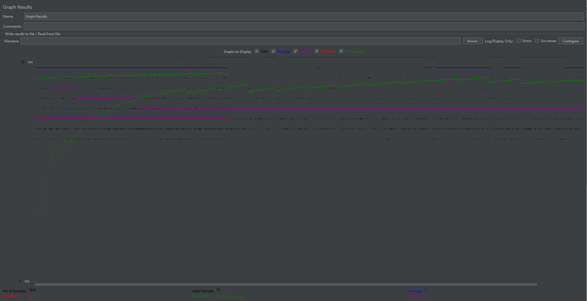

# cs122b-spring21-team-93

Project 1 Video Demo URL:                   https://vimeo.com/535382852

Project 2 Video Demo URL:                   https://vimeo.com/542397737

Project 3 Video Demo Redo URL (No pauses):  https://vimeo.com/552690167

Project 4 Video Demo URL:                   https://youtu.be/qcjEw1WuSNo

Project 5 Video Demo URL: 		            https://vimeo.com/559511161

Instructions for Deployment:
  1. git clone into repository
  2. run mvn clean package
  3. move built war into tomcat/webapps
  4. go to URL: http://ec2-18-188-209-46.us-east-2.compute.amazonaws.com:8080/cs122b-spring21-project1-api-example/

Project 4 Instructions for Deployment:
  1. git clone into repository
  2. run mvn clean package
  3. move built war into tomcat/webapps
  4. go to URL: https://18.144.57.54:8443/cs122b-spring21-project1-api-example/

Contributions:

Project 1:

    Rich:   Worked on MoviesServlet.java, single-star.html, single-star.js, AWS server testing, video demo

    Eric:   Worked on index.html, index.js, single-movie.html, single-movie.js, SingleMovieServlet.java, SingleStarServlet.java

Project 2:

    Rich:   CartServlet, DecreaseCartServlet, PaymentServlet, PlaceOrderServlet, SearchServlet,
            cart.html, cart.js, payment.html, payment.js, place-order.html, search.html, search.js,
            single-movie.html

    Eric:   BrowseByGenreServlet, BrowseByTitleServlet, IndexBrowseGenreServlet, LoginFilter, LoginServlet,
            MoviesServlet, SearchServlet, SingleMovieServlet, SingleStarServlet, User,
            browse.html, browse.js, browse-genre.html, browse-genre.js, cart.html, cart.js, index.html, index.js,
            login.html, login.js, movielist.html, movielist.js, payment.html, place-order.html,
            search.html, search.js, single-movie.html, single-movie.js, single-star.html, single-star.js

Project 3:

    Rich:   Task 2, Task 3, creating DOM Parser files with basic framework, partial completion of Stars and
            StarsinMovies parsers for insert statement creations, Video Demo

    Eric:   Task 4, Task 5, Task6, Debugging and completion of all parser files

    Task 7 Optimization Report
    Unfortunately, we did not initially implement our parsers with a naive implementation and test the timings. We
    immediately started to implement our optimization techniques along with developing the parser when we started
    working on the Task 7.

    Optimization Technique 1
    Our first optimization technique was using a in-memory hash table to keep the database's current and added movies,
    stars, and genres. This technique allowed us to eliminate duplicates, preveting the parser from creating insertion
    queries that would insert duplicates. The parser would initially get all the current movies/stars/genres and store
    them into the correspoding HashSet/HashMap. As the parser parses the xml files, it will add the new 
    movies/stars/genres into the HashSet/HashMap to prevent duplicates coming from the same xml file.

    Optimization Technique 2
    Our second optimization technique was writing to a SQL file. This technique although not covered in lectures, seems
    similar to writing to a csv file and using load data. We first thought to write to a csv file then we remembered a
    piazza post (https://piazza.com/class/kmp5a06y7zw243?cid=150) where the entire movie-data.sql file took only 3-4 
    mins to execute all (187k) insertion statements with this technique. Essentially, this is also similar to batch 
    insert except all the insertion statements generated by the parser is one transaction instead of multiple, 
    large transactions.

    Time Total of Parsing
    MoviesParser parsing time + mains243Inserts.sql execution time + mains243Genres.sql execution time = 
    5.618 s + 1 s + 1 s = 7.618 seconds

    StarsParser parsing time + actors63Inserts.sql execution time + =
    4.223 s + 1s = 5.223 seconds

    StarsinMoviesParser parsing time + casts124Inserts.sql execution time = 
    5.143 s + 4 s = 9.143 seconds

    Total time = 21.984 seconds

Project 4:

    Rich:   Task 2 bulk of android Implementation

    Eric:   Task 1, Task 2 movie list pagination and recaptcha filtering, video demo

Project 5:

    - # General
    - #### Team#: 93
    
    - #### Names: Tzu-Kai Rich Mo, Eric Nguyen
    
    - #### Project 5 Video Demo Link: https://vimeo.com/559511161

    - #### Instruction of deployment:

    1. git clone into repository
    2. run mvn clean package
    3. move built war into tomcat/webapps
    4. Repeat for 3 instances: single, master, slave
    5. Single instance url: http://54.183.131.0:8080/cs122b-spring21-project1-api-example/
      a. Alternatively for HTTPS: https://54.183.131.0:8443/cs122b-spring21-project1-api-example/
    6. Master instance url: http://52.53.163.81:8080/cs122b-spring21-project1-api-example/
    7. Slave instance url: http://54.176.156.248:8080/cs122b-spring21-project1-api-example/
    8. AWS load balancer url: 18.144.99.128/cs122b-spring21-project1-api-example/
    9. GCP load balancer url: 34.70.167.132/cs122b-spring21-project1-api-example/

    - #### Collaborations and Work Distribution:

    Rich - Task 4.2, Task 4.3 Running JMeter tests/Running log_processing.java on measured performances, Video Demo

    Eric - Task 1, Task 2, Task 3, Task 4.1, Task 4.2 Preparing AWS and GWS for measuring performances

- # Connection Pooling
    - #### Include the filename/path of all code/configuration files in GitHub of using JDBC Connection Pooling.
  
    1. cs122b-spring21-team-93/WebContent/META-INF/context.xml 
    2. All files in: cs122b-spring21-team-93/src
    
    - #### Explain how Connection Pooling is utilized in the Fabflix code.

    Connection Pooling: 
  
      factory="org.apache.tomcat.jdbc.pool.DataSourceFactory"
      maxTotal="100" maxIdle="30" maxWaitMillis="10000"

        maxTotal        -   Represents the maximum number of connections allowed in the pool at any time which is set to
                            100 connections
        maxIdle         -   Represents the total number of idle connections or "unused" connections allowed in the pool
                            at any time which is set to 30 connections
        maxWaitMillis   -   Represents the timeout in terms of milliseconds. The timeout is described as the amount of time
                            the connection "waits" for the database to accept the connection.
                            This is set to 10,000 milliseconds which is 10 seconds.

        Every servlet makes a connection to the database when they are initialized within the function code of
        init(ServletConfig config). However, after a connection is made, it is not closed. The servlets instead, leave
        the connection for another servlet to use. This increases the efficiency of servlets since connections do not
        need to opened again (unless idled too long and thus closed) and another servlet can just grab the next
        available connection.

    Prepared Statements:

        Prepared Statements are all used within this folder: cs122b-spring21-team-93/src
        Files included are:
            AutoSearchServlet.java
            BrowseByGenreServlet.java
            BrowseByTitleServlet.java
            CartServlet.java
            CheckMovieProcedure.java
            IndexBrowseGenreServlet.java
            InsertMovieServlet.java
            InsertStarServlet.java
            LoginServlet.java
            LoginStaffServlet.java
            PlaceOrderServlet.java
            SearchServlet.java
            ShowDatabaseMetadata.java
            SingleMovieServlet.java
            SingleStarServlet.java

        Most of the Java files use Prepared Statements in their code since they are Java Servlets that talk to the database
        to get the data that they need. We created Prepared Statements by these steps:
            1.  Defining the MySQL query as a string with the symbol "?" at places within the string where the servlet
                inputs information entered by the user or information sent from the webpage.

            2.  Then in a try-catch block, we create the Connection to the database and create the Prepared Statements
                using the Connection's prepareStatement() call by passing in the query string we created earlier.

    - #### Explain how Connection Pooling works with two backend SQL.

    Since reading queries are sent to both the master/slave backend SQL, that means with the current settings we have
    which are maxTotal="100", maxIdle="30", and maxWaitMillis="10000", there will be a total of 200 connections for
    read requests. This means that there will be as twice as many connections for users to use to complete their
    requests. With only one backend SQL, there is only 100 connections possible which decrease the response time of
    their requests since they may have to wait until a connection is open. However, since writing requests are only
    sent to the master, writes will still be the same speed even with connection pooling.

- # Master/Slave
    - #### Include the filename/path of all code/configuration files in GitHub of routing queries to Master/Slave SQL.
  
    1. cs122b-spring21-team-93/src/InsertMovieServlet.java
    2. cs122b-spring21-team-93/src/InsertStarServlet.java
    3. cs122b-spring21-team-93/src/PlaceOrderServlet.java

    - #### How read/write requests were routed to Master/Slave SQL?

    All requests use a datasource connection to one of the two resources within the context.xml file. The port 3306
    is the port number of access a MySQL database. Read requests use the resource simply named "moviedbexample" while
    write requests use the resource named "moviedbexample-master". The "moviedbexample" resource has localhost as the
    IP address of the url. This means that whatever Tomcat server the user is in, it will use the corresponding
    MySQL database that lives along the Tomcat server within the AWS instance. For write requests instead, the IP
    address of the resource "moviedbexample-master" has a direct, private IP address to the master AWS instance with
    the port 3306, allowing the servlet to connect to the master MySQL database.

- # JMeter TS/TJ Time Logs
    - #### Instructions of how to use the `log_processing.*` script to process the JMeter logs.

    1. Make sure the JMeter logs are within the directory: cs122b-spring21-team-93/autoSearchPerformance/performances

    2. On line 8, a file is created for reading: File f = new File("autoSearchPerformance/performances/single1.txt");
        a. Simply change the file name at the end which in this case is "single1.txt" to the file name of the desired
        JMeter log to process

    3. Right click within the log_process.java file and click " 'Run log_processing.main()' " to run the processor
        a. Alternatively, CTRL + SHIFT + F10 within the file will also run the processor

- # JMeter TS/TJ Time Measurement Report

| **Single-instance Version Test Plan**          | **Graph Results Screenshot** 						   | **Average Query Time(ms)** | **Average Search Servlet Time(ms)** | **Average JDBC Time(ms)** | **Analysis** 															      		       |
|------------------------------------------------|---------------------------------------------------------------------------------|----------------------------|-------------------------------------|---------------------------|------------------------------------------------------------------------------------------------------------------------------------------------------------|
| Case 1: HTTP/1 thread                          |   | 17                         | 3                                   | 1                         | The one threaded jmeter test had understandably the fastest average query time of 17 ms due to having the least load on the server.  		       |
| Case 2: HTTP/10 threads                        |       | 41                         | 23                                  | 13                        | The 10 thread test produced more stress on the server, resulting in a slower average query time of 41 ms.           		      		       |
| Case 3: HTTPS/10 threads                       | | 41                         | 23                                  | 13                        | Changing the protocol to HTTPS for another 10 thread test didn't produce a noticeable difference compared to the 10 thread HTTP test.		       |
| Case 4: HTTP/10 threads/No connection pooling  |       | 45                         | 22                                  | 10                        | Doing the 10 thread test without connection pooling resulted in a slower average query time, but a faster average search servlet and JDBC time.            |

| **Scaled Version Test Plan**                   | **Graph Results Screenshot** 						   | **Average Query Time(ms)** | **Average Search Servlet Time(ms)** | **Average JDBC Time(ms)** | **Analysis** 																	       |
|------------------------------------------------|---------------------------------------------------------------------------------|----------------------------|-------------------------------------|---------------------------|------------------------------------------------------------------------------------------------------------------------------------------------------------|
| Case 1: HTTP/1 thread                          |         | 21                         | 2                                   | 1                         | Doing the 1 thread test on the scaled version resulted in a slower average query time than the single-instance but a faster average search servlet time.   |
| Case 2: HTTP/10 threads                        |       | 26                         | 8                                   | 4                         | Switching to 10 threads on the scaled version resulted in a slower response time all around.           						       |
| Case 3: HTTP/10 threads/No connection pooling  |       | 26                         | 8                                   | 4                         | Doing the 10 thread test without connection pooling didn't produce any noticeable differences, and the jmeter test produced the same values.               |